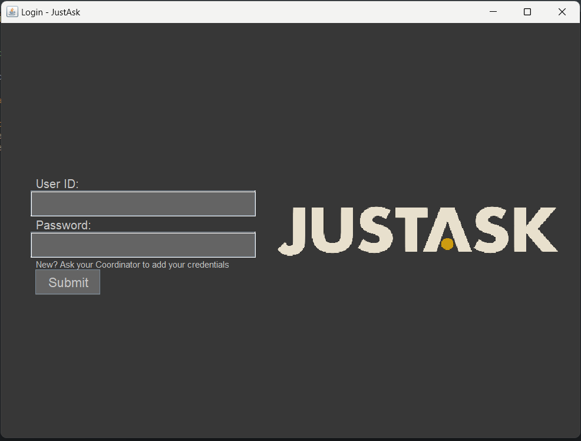
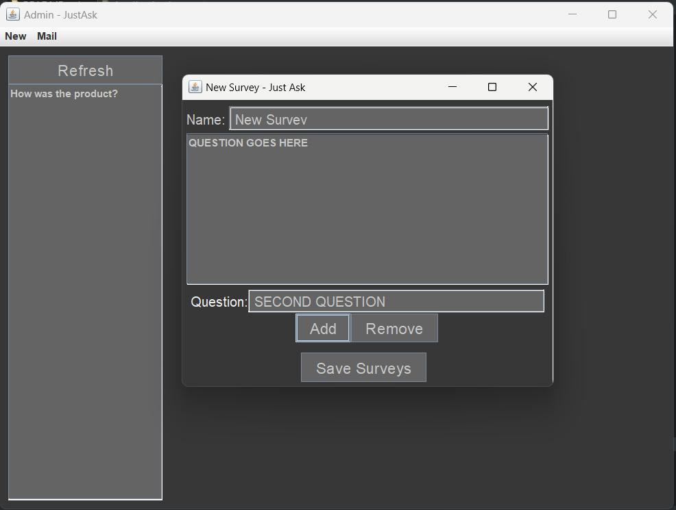
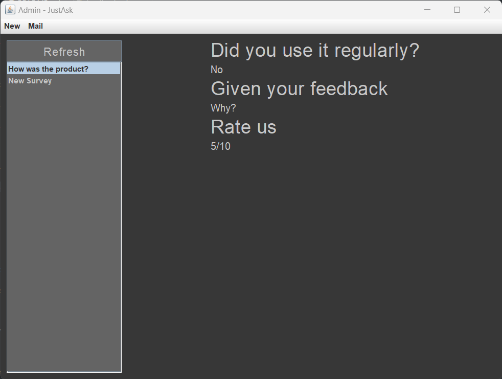

# JustAsk - Survey Application

JustAsk is a Java-based survey application that allows administrators to create question-based surveys and manage users. Users can anonymously answer surveys, while administrators can view survey responses. This project aims to provide a simple and user-friendly platform for conducting surveys and gathering valuable insights.



## Features

- User and Admin login panels for secure access.
- Admins can create question-based surveys and add new users.
- Users can view and answer surveys anonymously.
- Admins can view and analyze survey responses.

## Installation

To run the JustAsk survey application locally, follow these steps:

1. Clone the repository:

   ```bash
   git clone https://github.com/SujalChoudhari/JustAsk.git
   ```

2. Set up the required external library:

   - Download the MongoDB Java driver JAR file from [https://mongodb.github.io/mongo-java-driver/](https://mongodb.github.io/mongo-java-driver/).

   - Place the `mongo-java-driver-3.12.14.jar` file in the `/Justask/external/` directory of the project.

3. Import the project into your preferred Java IDE (e.g., Eclipse).

4. Configure the module dependencies:

   - Right-click on the project in the IDE.
   - Select "Build Path" -> "Configure Build Path".
   - In the "Libraries" tab, click on "Classpath" -> "Add JARs".
   - Navigate to the `/Justask/external/` directory and select `mongo-java-driver-3.12.14.jar`.
   - Click "Apply" and "OK" to save the changes.

5. Build and run the application using your IDE's built-in tools.

## Usage

1. Run the `Application` (Make sure database services are active)

2. Use the provided login panel to authenticate as either a User or an Admin.  
	Admin account might not exist for the first time, so run the `main` of the `Database` class to create a admin.  
	By default, username = `admin`, password=`admin` 

3. Admins can create surveys and manage users. Users can view and answer surveys anonymously.

4. Admins can access the responses to the surveys and analyze the collected data.

## Database Configuration

The JustAsk survey application uses MongoDB as its database. The `Database` class in the `com.sujal.justask.util` package handles the connection to the database. Here is an example of how the MongoDB connection is established:

```java
package com.sujal.justask.util;

import com.mongodb.MongoClient;
import com.mongodb.client.MongoCollection;
import com.mongodb.client.MongoDatabase;

import org.bson.Document;

import java.util.ArrayList;
import java.util.HashMap;
import java.util.List;
import java.util.Map;

public class Database {
    private MongoClient mMongoClient;
    private MongoDatabase mDatabase;

    public static Database CONNECTED_DATABASE = new Database("justask");

    public Database(String databaseName) {
        mMongoClient = new MongoClient("localhost");
        mDatabase = mMongoClient.getDatabase(databaseName);
    }
    // ... more code
}
```

Make sure you have MongoDB installed and running on your local machine before running the JustAsk application.

## Contributing

Contributions to JustAsk are welcome and appreciated. To contribute, please follow these guidelines:

1. Open an issue to discuss the proposed changes and obtain feedback before implementing them.

2. Fork the repository and create a new branch for your feature or bug fix.

3. Ensure that your code adheres to the project's coding conventions and style.

4. Make sure to test your changes thoroughly.

5. Submit a pull request, referencing the original issue and providing a brief description of your changes.

## License

JustAsk is licensed under the [MIT License](LICENSE).

## Screenshots


*Screenshot 1: Login Panel*



*Screenshot 2: Survey Creation*



*Screenshot 3: Survey Response*